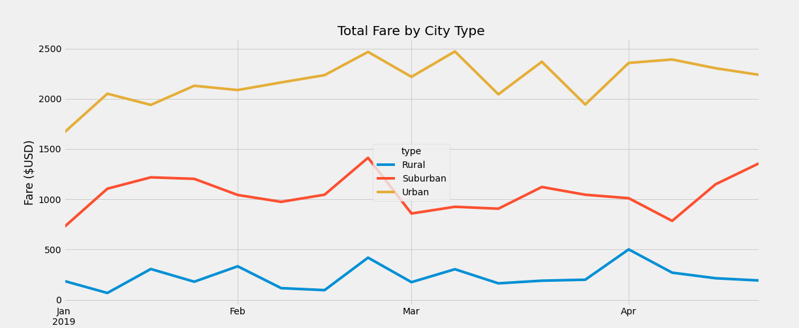

# PyBer-Analysis

### Overview of the analysis: 
* Analyzing PyBer rideshare data filtering the data by type of city, (“Urban”, “Suburban”, & “Rural”) in order to determine weekly fares per each city type and be able to visualize the results.

### Results

* Based on the “% of Total Fares by City type” figure above, it shows that Urban cities generate 62.7 % of total fares compared to 30.5% from Suburban cities and 6.8% from Rural cities. 

#### % Total Fare by City Type Analysis

###### Urban
* Urban cities produced the most money over the course of our analysis with its peaks at the end of February and early March

###### Suburban
* Suburban cities showed their peak at the end of February before plateauing from March - April.

###### Rural
* Rural cities producing the lowest amount of total fares showed a steep increase to peak at the beginning of April 

### Summary: 
* One recommendation based on the analysis would be to relocate some drivers (in the forms of incentives, higher payouts, etc.) during the highs and lows of other cities. During some of the slower months in the Urban cities, certain drivers could pick up on the noted “peaks” of Suburban or Rural cities. 
* Another recommendation would be to hire more seasonal workers in order to fill in when Total Fares routinely increases based on demand in each different city type. 
* Lastly, experimenting with pricing during the week over week data could help in Rural or Suburban cities relative to Urban cities. As we see in Figure 2 at the end of February we see an increase in % Total Fares in all 3 city types which could correlate to more rides being taken. An increase of price during times like those could prove beneficial for PyBer. 
